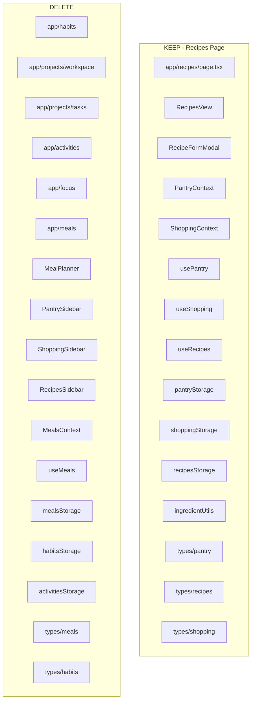

# Comprehensive Cleanup Plan: Remove Dead Code, Hidden Pages, and Add Recipes

## Overview

This plan consolidates:
1. **Dead code removal**: Beta (already gone), Meals (meal planning only), nav filtering logic
2. **Hidden pages removal**: Habits, Workspace, Tasks, Activities, Focus — pages that existed but were not in the main nav
3. **Recipes extraction**: Keep Recipes as a standalone page and add it to the main nav

---

## Scope Summary

| Category | Action |
|----------|--------|
| **Beta** | Already removed (no `app/beta/`). No code changes. |
| **Meals** | Remove meal planning, MealPlanner, MealsContext, mealsStorage. Keep pantry/recipes/shopping for Recipes page. |
| **Nav filtering** | Remove `SHOW_MEALS_IN_NAV` and `filteredNavItems`; use `navItems` directly. |
| **Hidden pages** | Delete Habits, Workspace, Tasks, Activities, Focus and their supporting code. |
| **Recipes** | New standalone page at `/recipes` in main nav. |

---

## Phase 1: Create Standalone Recipes Page

### 1.1 Create `app/recipes/page.tsx`

```tsx
'use client';
import React, { Suspense } from 'react';
import { AppLayout } from '@/components/ui/AppLayout';
import { PantryProvider } from '@/app/context/PantryContext';
import { ShoppingProvider } from '@/app/context/ShoppingContext';
import { RecipesView } from '@/components/recipes';

export default function RecipesPage() {
  return (
    <AppLayout>
      <PantryProvider>
        <ShoppingProvider>
          <Suspense fallback={<div className="text-muted-foreground">Loading recipes...</div>}>
            <RecipesView />
          </Suspense>
        </ShoppingProvider>
      </PantryProvider>
    </AppLayout>
  );
}
```

### 1.2 Create `components/recipes/RecipesView.tsx`

Extract from [components/meals/RecipesSidebar.tsx](components/meals/RecipesSidebar.tsx):
- **Keep**: recipe list, cookable section, suggested tiers (high/medium/low), add-to-shopping buttons, RecipeFormModal, useRecipes, usePantryContext, useShopping
- **Remove**: `useMealsContext`, `dateKey` prop, B/L/D "add to meal" buttons (lines 62–98)
- No `dateKey` prop needed

### 1.3 Create `components/recipes/index.ts`

```ts
export { RecipesView } from './RecipesView';
```

---

## Phase 2: Update Navigation

In [components/ui/Navigation.tsx](components/ui/Navigation.tsx):

1. Remove `import { SHOW_MEALS_IN_NAV } from '@/lib/constants'`
2. Replace Meals nav item with Recipes:
   - `key: 'recipes'`
   - `href: '/recipes'`
   - `label: 'Recipes'`
   - `icon: ClipboardList` (or ChefHat if imported)
3. Replace `filteredNavItems` with `navItems` (use `navItems.map` instead of `filteredNavItems.map`)
4. Update default `expandedNavItems`: remove `'workspace'` (no longer exists)

---

## Phase 3: Delete Pages (Hidden and Dead)

### 3.1 Delete page directories

| Path | Description |
|------|-------------|
| `app/habits/` | Habits page |
| `app/projects/workspace/` | Workspace Today (focus + project tasks) |
| `app/projects/tasks/` | Tasks + Tasks/weekly |
| `app/activities/` | Activities page |
| `app/focus/` | Focus mini timer |
| `app/meals/` | Meals page |

### 3.2 Delete Meals-only code

| Path | Notes |
|------|-------|
| `components/meals/MealPlanner.tsx` | Meal planning grid |
| `components/meals/PantrySidebar.tsx` | Pantry UI (Recipes uses PantryContext, not this) |
| `components/meals/ShoppingListSidebar.tsx` | Shopping UI (Recipes uses useShopping, not this) |
| `components/meals/RecipesSidebar.tsx` | Replaced by RecipesView |
| `components/meals/index.ts` | Delete entire `components/meals/` directory |
| `app/context/MealsContext.tsx` | Meals state only |
| `hooks/useMeals.ts` | Meals hook only |
| `utils/mealsStorage.ts` | Meals persistence |
| `types/meals.ts` | Meals types |

### 3.3 Delete Habits code

| Path |
|------|
| `utils/habitsStorage.ts` |
| `types/habits.ts` |

### 3.4 Delete Activities code

| Path |
|------|
| `utils/activitiesStorage.ts` |

**Keep for Recipes**: PantryContext, ShoppingContext, usePantry, useShopping, useRecipes, pantryStorage, shoppingStorage, recipesStorage, ingredientUtils, types/pantry, types/recipes, types/shopping, RecipeFormModal

---

## Phase 4: Fix Links to Deleted Routes

### 4.1 [components/calendar/WeeklyGoalsCalendarView.tsx](components/calendar/WeeklyGoalsCalendarView.tsx)

`createTaskFromGoal` (line ~168) currently navigates to `/projects/tasks?action=create&...`.

**Change to**: Navigate to `/projects` instead. User can create a project/task from the projects list.

```ts
window.location.href = `/projects?${params.toString()}`;
```

(Projects page may not handle these params; the link will at least land on a valid page.)

---

## Phase 5: Update Index Files and Exports

| File | Changes |
|------|---------|
| [components/index.ts](components/index.ts) | Remove `export * from './meals'`; add `export * from './recipes'` |
| [app/context/index.ts](app/context/index.ts) | Remove `export * from './MealsContext'` |
| [hooks/index.ts](hooks/index.ts) | Remove `useMeals` |
| [types/index.ts](types/index.ts) | Remove `meals`, `habits`; keep `pantry`, `recipes`, `shopping` |
| [utils/index.ts](utils/index.ts) | Remove `habitsStorage`, `activitiesStorage`; keep `ingredientUtils` |
| [components/modals/index.ts](components/modals/index.ts) | Keep RecipeFormModal |

---

## Phase 6: Constants and Config

### 6.1 [lib/constants.ts](lib/constants.ts)

- Delete `SHOW_MEALS_IN_NAV` constant and its comment

---

## Phase 7: Documentation Updates

| File | Changes |
|------|---------|
| [docs/structure.md](docs/structure.md) | Remove habits, activities, workspace, tasks, focus, meals; add recipes |
| [docs/utils.md](docs/utils.md) | Remove HabitsStorage, Meals Storage, ActivitiesStorage sections |
| [README.md](README.md) | Remove Meals, Habits, Activities, Workspace, Tasks, Focus; add Recipes |
| [hooks/README.md](hooks/README.md) | Remove useMeals; keep usePantry, useShopping, useRecipes |
| [docs/changelog.md](docs/changelog.md) | Add entry documenting this cleanup |

---

## Final Structure

### Main Nav

| Nav Label | Route |
|-----------|-------|
| Daily Planner | `/` |
| Calendar | `/calendar` |
| Projects | `/projects` |
| Text Documents | `/documents` |
| Recipes | `/recipes` |

### Remaining Pages

| Route | Page |
|-------|------|
| `/` | Daily Planner |
| `/class-schedule` | Class Schedule |
| `/calendar` | Calendar |
| `/visualizer` | 5-Year Visualizer |
| `/projects` | Projects list |
| `/projects/[id]` | Project detail |
| `/documents` | Text Documents |
| `/recipes` | Recipes |

### Deleted Routes

- `/habits`
- `/projects/workspace`
- `/projects/tasks`
- `/projects/tasks/weekly`
- `/activities`
- `/focus/mini`
- `/meals`

---

## Dependency Diagram



---

## Execution Order

1. **Phase 1**: Create Recipes page and RecipesView (before deleting meals)
2. **Phase 2**: Update Navigation
3. **Phase 3**: Delete pages and supporting code
4. **Phase 4**: Fix WeeklyGoalsCalendarView link
5. **Phase 5**: Update index files
6. **Phase 6**: Remove SHOW_MEALS_IN_NAV
7. **Phase 7**: Update documentation

---

## Verification Checklist

- [ ] `npm run build` succeeds
- [ ] No references to: useMeals, MealsContext, habits, activities, workspace, tasks, focus
- [ ] Recipes page loads at `/recipes`
- [ ] Nav shows: Daily Planner, Calendar, Projects, Text Documents, Recipes
- [ ] WeeklyGoalsCalendarView createTaskFromGoal redirects to `/projects`
- [ ] No broken imports or missing exports
